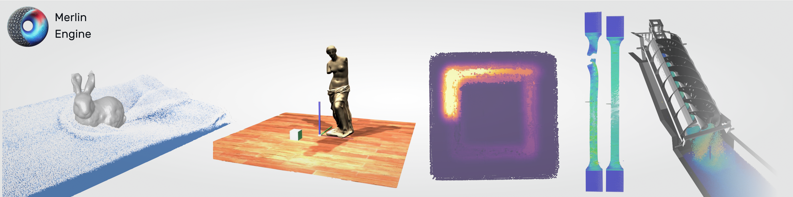

## Overview
Merlin is a GPU computing and rendering engine designed as a sandbox instead of CUDA or OpenCL. While still in development, Merlin offers basic 3D rendering capabilities and a compute shader pipeline. The framework is geared towards facilitating physics experiments, but it's worth noting that it's still evolving and might not yet match the full capabilities of more established tools.

Note: As Merlin is in development, this README aims to provide a balanced view of its current state, highlighting its potential while acknowledging its ongoing development status.

## Features
- **GPU Computing**: Utilizes GPU for computations, aiming to offer an alternative to CUDA.
- **Basic 3D Rendering**: Provides fundamental 3D rendering functionalities.
- **Compute Shader Pipeline**: Includes a pipeline for compute shaders, suitable for simple to moderately complex calculations.
- **Class Abstraction**: Offers class abstraction to ease the process of setting up and managing physics experiments.

## Getting Started
Merlin is in a developmental stage and might require some familiarity with GPU computing and rendering concepts.

1. **Clone the Repository**
```
git clone --recurse-submodules https://github.com/runeworks-engineering/merlin.engine.git
```

2. **Build the Engine**
   - Navigate to the Merlin directory.
   - Run `premake.bat` to generate Microsoft Visual studio projects and solution automatically.
   
   ```
   cd Merlin
   premake.bat
   ```
   
   Premake is packaged with Merlin inside the `extern folder`. You could also install premake on you machine and add it to your PATH environment variable to shorten the commands.
   

3. **Open MVSC Solution**
   - Open the `.sln` file in Microsoft Visual Studio.

4. **Compile Merlin**
   - Right click on the `merlin` project, under `Library`, and click `Generate`

The static library will be compiled and available inside the `bin` directory.

## Example Usage

Merlin has several examples that can be used as a starting point.
Each of these examples showcases a specific feature of the library:

1. **`merlin.example`**: A basic 3D rendering example with a sphere and a single light.
   - Use this as a starting point for projects that require basic 3D rendering with minimal setup.

2. **`merlin.example2D`**: A similar example using orthographic projection for 2D rendering.
   - Ideal for applications focused on 2D rendering, such as UI elements, sprites, or 2D visualizations.

3. **`merlin.particles`**: Demonstrates particle system features.
   - Use this to explore and implement complex particle effects or simulations

4. **`merlin.sandbox`**: A shaded rendering environment.
   - Perfect for experimenting with advanced rendering techniques like PBR (Physically Based Rendering) or testing shaders.


---

## Galery

**Rendering**


**Physics Sim**


## Limitations and Development Status

Merlin is a work in progress and may not yet be fully optimized or bug-free. Users should be prepared for potential issues and are encouraged to contribute to its development.

## Contributing

Contributions are welcome, especially in areas of bug fixing, feature enhancement, and documentation improvement. Please submit pull requests for any contributions.

## Support and Issues

For support or to report issues, please use the GitHub issue tracker associated with the repository.

## License

Merlin is released under CC BY-NC-SA. Please review the license terms before using or modifying the software.


## Credits

This project is built upon various OpenSource codes and tools.

- Marching cubes algorithm by [Michael Walczyk](https://michaelwalczyk.com/project-marching-cubes.html) inspired by explanation of [Paul Bourke](https://paulbourke.net/geometry/polygonise/).
- Signed distance function and rendering math by [Inigo Quilez](https://iquilezles.org/articles/distfunctions/)
- Model loading library : [Assimp](https://github.com/assimp/assimp) Even if Merlin can load models using the internal loader, it will fall back on Assimp for unsupported model formats.
- Graphical User Interface : [ImGui](https://github.com/ocornut/imgui) This library is used to make the super simple interface that make Merlin alive and interactive.
- OpenGL development kit : [GLFW](https://www.glfw.org/)

## Citation 

To cite Merlin you can use this BibTeX entry:

```bibtex
@software{Merlin_Library,
  author = {Topart. J},
  license = {CC BY-NC-SA},
  title = {{Merlin engine - Library}},
  url = {https://github.com/runeworks-engineering/merlin.engine},
}
```

# References

- Position based fluids [Position based fluids by Miles Macklin and Matthias Müller](https://dl.acm.org/doi/10.1145/2461912.2461984)
- Smoothed Particle Hydrodynamics Techniques for the Physics Based Simulation of Fluids and Solids [A course on Smoothed Particle Hydrodynamics (SPH)](https://sph-tutorial.physics-simulation.org/)

